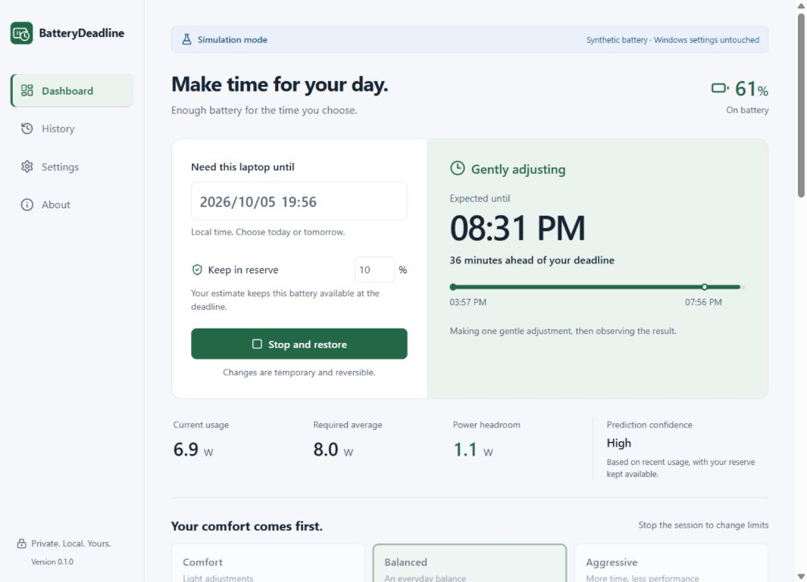

# BatteryDeadline

**Cruise control for laptop battery life.** Choose when you need your laptop until, keep a battery reserve, and let a local controller make small, reversible adjustments within your comfort limits.

[中文说明](README.zh-CN.md) · [Download](https://github.com/hanshuqimen/BatteryDeadline/releases) · [Specification assessment](docs/ASSESSMENT.zh-CN.md) · [Validation](docs/VALIDATION.md)



## What it does

- Reads real Windows battery telemetry with absolute energy units, multi-battery aggregation, and honest capacity/percentage fallbacks.
- Predicts when your chosen reserve will be reached. A deadline budget, confidence, and recent power chart make the estimate understandable.
- Adjusts supported internal-panel brightness, legal refresh rates, and a temporary **DC-only** processor policy. One change at a time, with a deadband, observation periods, and user-selected floors.
- Saves originals before modifying Windows, verifies writes, and restores on Stop, AC power, deadline, long sampling gaps, or normal Quit. Restart recovers unfinished changes after a crash.
- Respects later manual changes. An unavailable device leaves recovery pending and blocks another session.
- Includes Dashboard, History, Settings, About, a native tray, local diagnostics export, a CLI, and a deterministic hardware simulator using the production controller.
- Ships **Simplified Chinese, English, and Japanese** offline. The UI and native tray follow Windows by default; Settings lets you save a language choice immediately, including during a session. Dates/numbers follow that language.

**v0.1.1 is an initial preview release for Windows 11 x64.** It is a complete installable MVP, not a guarantee of reaching a deadline. Cross-device discharge, sleep, and performance validation remains necessary. Hardware restrictions are shown in the app. EcoQoS/process changes are deferred to v0.2; this release does not touch processes.

## Install and use

Download `BatteryDeadline_0.1.1_x64-setup.exe` from [Releases](https://github.com/hanshuqimen/BatteryDeadline/releases). The installer is per-user. WebView2 is required; its Microsoft bootstrapper is downloaded when missing. A portable ZIP and SHA-256 checksums are provided as well. These initial binaries are **unsigned**.

1. Open BatteryDeadline on a battery-powered Windows laptop.
2. Choose a full local date/time and a 5–30% reserve.
3. Pick Comfort, Balanced, or Aggressive; review supported controls and limits in Settings.
4. Start the session. Allow the estimator to learn your recent workload.
5. Use **Stop and restore**, or **Quit** in the tray, when finished. Closing the window hides it to the tray by default.

To explore without modifying Windows:

```powershell
.\battery-deadline.exe --simulate
.\battery-deadline-cli.exe --simulate --steps 600
```

Real-hardware diagnostics are read-only:

```powershell
.\battery-deadline-cli.exe diagnostics battery --json
.\battery-deadline-cli.exe diagnostics capabilities
```

## Build from source

Windows 11 x64, Node.js 24+, pnpm 11.25.0, stable Rust (MSRV 1.90), Visual Studio C++ Build Tools, Windows SDK, and WebView2 are required for the desktop build. No administrator privileges are requested by the application.

```powershell
git clone https://github.com/hanshuqimen/BatteryDeadline.git
cd BatteryDeadline
pnpm install --frozen-lockfile
pnpm desktop:dev
```

Run the desktop simulator with `pnpm tauri dev -- --simulate`. For browser UI development, use two terminals:

```powershell
cargo run -p battery-deadline-core --bin battery-deadline-preview
pnpm dev
```

Open `http://127.0.0.1:1420/?simulate`. This development bridge binds to loopback, accepts only simulation commands, and is absent from the production desktop.

```powershell
cargo fmt --all -- --check
cargo clippy --workspace --all-targets --locked -- -D warnings
cargo test --workspace --locked
pnpm format:check
pnpm lint
pnpm test
pnpm build
pnpm desktop:build
cargo build --release --locked -p battery-deadline-core --bin battery-deadline-cli
.\scripts\package-release.ps1
```

Stop a running development bridge before rebuilding its executable on Windows. Browser watchers exclude Rust build directories. The portable core and simulator can also be tested on Linux with `cargo test -p battery-deadline-core --locked`.

## Safety and privacy

BatteryDeadline has no account, analytics, ads, cloud API, or uploaded battery readings. SQLite and logs stay under `%LOCALAPPDATA%\BatteryDeadline`; real and simulated data use separate files and locks. Settings/recovery persist, telemetry is retained for 7 days, history/actions for 180 days, and file logs for 7 days. Diagnostic ZIPs are created locally and are only shared if you choose to share them.

Recovery needs the application to run. A killed process cannot instantly undo system changes. Restart the **same mode** to recover; reconnect the original display if needed. Do not delete the data directory while recovery is pending. See [Recovery](docs/RECOVERY.md).

“Expected until” means reaching the reserve, not zero battery. Percent-only telemetry never becomes fictitious watts. Observed power differences are not causal proof of energy savings; history leaves saved Wh unavailable when it cannot be established.

## Project layout

| Path | Responsibility |
| --- | --- |
| `crates/battery-core` | Telemetry models, estimator, controller, SQLite journal, hardware adapters, simulator, actor service, CLI |
| `src-tauri` | Native window, typed IPC, tray, lifecycle, NSIS packaging |
| `src` | Strict React/TypeScript UI; no hardware writes or controller decisions |
| `tests` | Frontend date, presets, and honest-chart checks |
| `docs` | Assessment, architecture, recovery, validation, and release process |
| `.github/workflows` | Windows build/test artifacts, portable-core checks, release publishing |

See [Architecture](docs/ARCHITECTURE.md), [Contributing](CONTRIBUTING.md), [Security](SECURITY.md), and [Changelog](CHANGELOG.md). Licensed under [MIT](LICENSE).
