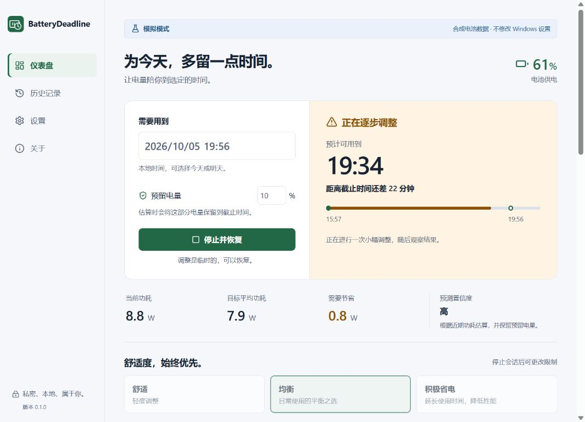

# BatteryDeadline

**笔记本电池的定速巡航。** 选择需要用到的时间和预留电量，程序根据真实读数，在舒适度限制内缓慢调整可用的系统设置。

[English](README.md) · [下载安装包](https://github.com/hanshuqimen/BatteryDeadline/releases) · [提示词合理性与可行性评估](docs/ASSESSMENT.zh-CN.md)



## 已实现

- Windows 真实电池读取、多电池完整聚合；缺失功率时使用容量斜率或百分比降级预测，不捏造瓦数。
- 根据预留电量计算可用能量、截止时间功率预算、预计可用时间、余量和置信度。
- 内置面板亮度、合法刷新率、临时电源计划中的电池供电 CPU 上限。每次只修改一个变量，包含持续不足判断、死区和观察期。
- 修改前持久化原值和目标值，修改后回读验证；停止、插电、到达截止时间、长采样断层和正常退出时恢复。
- 崩溃后下次启动恢复，尊重用户后续手动修改；设备不可用时保留恢复记录并阻止新会话。
- 仪表盘、历史、设置、关于、系统托盘、本地诊断 ZIP、只读 CLI、使用同一控制核心的模拟器。
- **原生支持简体中文、英语、日语**，全部文案随程序离线打包。默认跟随 Windows，可在设置中随时切换并保存；切换不会中断会话，日期和数字格式同步调整。系统托盘也支持三种语言。

v0.1.0 是 **Windows 11 x64 的首个预览版本**，具备完整 MVP 和安装包。续航预测不是保证；厂商驱动、负载、电池老化会影响结果。尚需跨机型放电、睡眠和性能实测，详见 [验证记录](docs/VALIDATION.md)。EcoQoS 按原规格允许延后至 v0.2，本版不修改进程。

## 使用

从 [Releases](https://github.com/hanshuqimen/BatteryDeadline/releases) 下载安装程序或便携 ZIP。安装程序按当前用户安装；缺失 WebView2 时下载微软安装引导程序。首版二进制尚未代码签名，同时提供 SHA-256 校验文件。

选择完整日期和时间，设置 5–30% 预留电量，选择 Comfort / Balanced / Aggressive，查看设备支持情况后开始。使用 **Stop and restore** 停止并恢复；关闭窗口默认收到托盘，托盘的 **Quit** 会先恢复再退出。

```powershell
# 模拟模式：不会修改 Windows 设置
.\battery-deadline.exe --simulate
.\battery-deadline-cli.exe --simulate --steps 600

# 只读真实硬件诊断
.\battery-deadline-cli.exe diagnostics battery --json
.\battery-deadline-cli.exe diagnostics capabilities
```

## 开发

需要 Node.js 24+、pnpm 11.25.0、稳定版 Rust（最低 1.90）、Visual Studio C++ Build Tools、Windows SDK 和 WebView2。

```powershell
git clone https://github.com/hanshuqimen/BatteryDeadline.git
cd BatteryDeadline
pnpm install --frozen-lockfile
pnpm desktop:dev
# 原生模拟界面
pnpm tauri dev -- --simulate
# Windows 安装包
pnpm desktop:build
```

浏览器开发预览：分别启动 `cargo run -p battery-deadline-core --bin battery-deadline-preview` 和 `pnpm dev`，打开 `http://127.0.0.1:1420/?simulate`。后端实际运行 Rust 控制器，数据明确标记为合成数据。

测试、架构和发布命令见 [英文 README](README.md)、[架构](docs/ARCHITECTURE.md) 和 [发布流程](docs/RELEASE.md)。

所有数据保存在 `%LOCALAPPDATA%\BatteryDeadline`，真实模式和模拟模式分库。没有云服务、遥测上传或账号。进程被强杀时不能立即执行恢复，需要重新启动同一模式；恢复未完成前不要删除数据目录。设备重新连接后可重试恢复。详见 [恢复机制](docs/RECOVERY.md)。

许可证：[MIT](LICENSE)。
