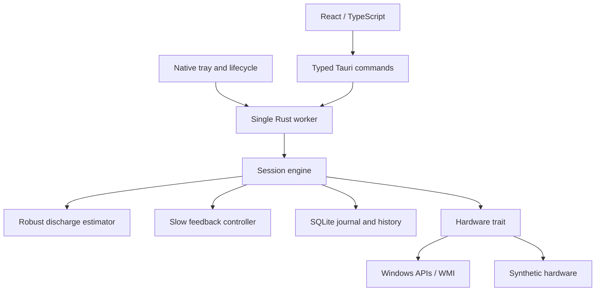

# Architecture

`battery-core` owns behavior. Tauri owns the native shell, tray and lifecycle. React renders snapshots and sends validated requests; it never decides or writes a hardware setting. The actor worker serializes COM/WMI, SQLite and actuator operations so concurrent IPC cannot race recovery.

## Telemetry and estimates

`GetSystemPowerStatus` provides battery/power-source basics. Battery-class enumeration and IOCTLs query energy, full/design capacity, signed rate and voltage. Relative units, partial multi-battery readings, UPS devices and unknown sentinels never enter the Wh model. Unknown AC status is unsafe for actuation. Enumeration is cached; repeated queries retain handles only for the duration of each read.

Positive power measurements use a trailing 20-second median and time-aware EWMA (75-second time constant). Minimum sample duration, recent variability and source quality influence confidence. Capacity slope needs at least 60 seconds and a measurable drop. Percent slope gives runtime without watts. AC, battery identity changes and sampling gaps reset the estimator.

`usable Wh = remaining Wh - full-charge Wh × reserve fraction`. The average budget is usable Wh divided by hours until the chosen deadline. The displayed end time is reserve crossing. Historical energy savings stay null without a valid counterfactual. Short-term before/after observations only guide actuator preference.

## Control

The controller targets +8 to +22 minutes of margin. It requires a sustained 20-second deficit, waits between actions, changes one actuator per decision and relaxes only after 90 seconds of surplus. Brightness reductions respect supported levels and a maximum 10-point step. Refresh rates are enumerated for unchanged geometry/color depth/orientation; cloned, external or HDR-uncertain topologies are disabled. Processor control changes the DC maximum in a newly cloned power scheme and leaves the original scheme intact.

Supported controls have user-selected floors. Repeated failures and later manual edits pause a control. A minimum observed power is evidence, not an estimate of guaranteed achievable savings. Percent-only or unstable readings cannot trigger aggressive tuning.

## Journal and lifecycle

Every mutation is `snapshot → SQLite pending commit → guarded write → readback → applied marker`. CPU destination GUIDs are chosen before journaling. Recovery reads pending and applied entries in reverse order. A crash between any pair of steps is covered by the same original/desired comparison. Manual brightness/refresh overrides supersede that device's chain; temporary CPU schemes are removed when safe to do so.

Stop, AC/unknown power source, deadline, reserve exhaustion, sleep-like gaps and normal Quit restore. A failed restore stays pending and blocks new sessions. Restart performs recovery before starting any control. A force-killed process cannot restore until it runs again. CPU schemes explicitly modified/adopted by the user may be retained rather than deleted underneath them.

## Persistence and boundaries

Real and simulated realms have distinct SQLite files/lock files. WAL plus FULL synchronization protects journal commits; filesystem errors do not authorize a write. Session telemetry is saved every 10 seconds; UI chart memory is bounded. Telemetry retention is 7 days, history/actions 180 days, completed recovery records 30 days; pending recovery is never purged. Settings and device-specific observed effects persist.

The native service's request queue is bounded. Long work runs outside the UI thread. The frontend pauses polling when hidden; tray updates every 10 seconds. Logs rotate daily with a 7-file limit. Diagnostic ZIPs have a fixed local destination and fixed entries (version, capabilities, activity), with no arbitrary file upload or path command.
